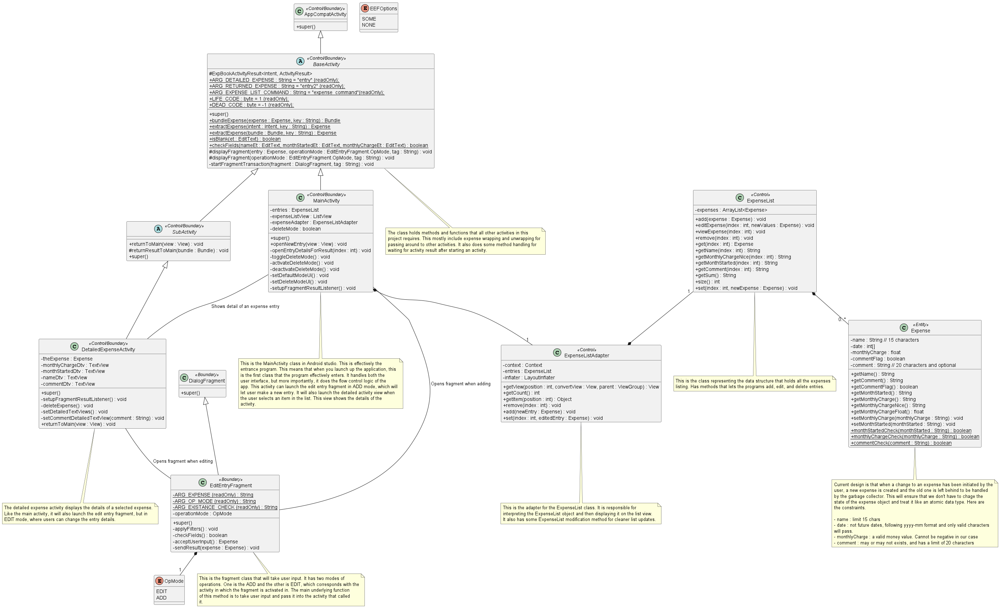

# CMPUT 301 Assignment 1 README

## Goal of the program

- Track subscriptions
  - Add new expense
  - Edit previous expense
  - Delete expense
- Display the expenses
  - Minimally, need to display the following fields:
    - name
    - date
    - monthly charge
- User aid
  - Enforce the type of the input in each of the field

The data that is stored also have to be in a certain format, so we should be doing a check on the correctness of the user input.

## Code base

A generated APK has been created and placed in the `\app\build\outputs\apk\debug` relative path of the project. Every java file has extensive documentation, so any question about what each method does can be found there.

## UML Diagram

## Usage

Launch the project on Android Studio and then run it on an android virtual machine.

### App guide

- You can add, delete and view entries on the main page
  - You can add an entry by pressing on the `Add Expense` button and properly inputting the fields.
  - You can view the details of an entry by pressing on the list item, which will launch up a new activity with the details.
  - You can activate delete mode by tapping the `Delete Expense` button.
    - When in delete mode, you can consecutively delete entries just by pressing on them.
- When in the detailed view, you can choose to edit, delete, or go back.
  - You can edit by tapping the `Edit Entry` button. A fragment for changing the entry will show up.
  - You can delete the expense by tapping the delete entry button. Upon doing this, the activity will kick the user back to the main activity page with the expense removed.
  - When you press the back button, you will return to the main activity. If there were edits made, then the main activity will be updated as well.

This is the main activity of the application

This is the add expense fragment view

This is the delete mode where when a user taps a list item, it will delete

This is the detailed view, where the user can see the comment

This is the edit expense page that users can enter from the detailed view page.
